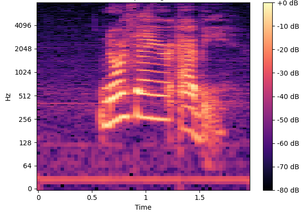

[](https://opensource.org/licenses/MIT)
[](https://gpuopen-professionalcompute-libraries.github.io/rpp/)

<p align="center"></p>


> [!NOTE]
> The published documentation is available at [ROCm Performance Primitives (RPP)](https://rocm.docs.amd.com/projects/rpp/en/latest/index.html) in an organized, easy-to-read format, with search and a table of contents. The documentation source files reside in the `docs` folder of this repository. As with all ROCm projects, the documentation is open source. For more information on contributing to the documentation, see [Contribute to ROCm documentation](https://rocm.docs.amd.com/en/latest/contribute/contributing.html).

AMD ROCm Performance Primitives (RPP) library is a comprehensive, high-performance computer
vision library for AMD processors that have `HIP`, `OpenCL`, or `CPU` backends.

<p align="center"></p>

#### Latest release
[](https://github.com/ROCm/rpp/releases)

## Supported functionalities and variants

<p align="center"></p>

<p align="center"></p>

### Supported 3D Functionalities Samples

Input<br>(nifti1 .nii medical image) | fused_multiply_add_scalar<br>(brightened 3D image)
:-------------------------:|:-------------------------:
  |  

## Supported audio functionalities and variants
* Below are the list of audio functions supported
  * Non Silent Region Detection (HOST and HIP)
  * To Decibels (HOST and HIP)
  * Downmixing (HOST and HIP)
  * Preemphasis Filter (HOST and HIP)
  * Resample (HOST and HIP)
  * Mel Filter Bank (HOST and HIP)
  * Spectrogram (HOST and HIP)

Spectrogram kernel output represented as a image <br><br>

  
## Prerequisites

* Linux
  * Ubuntu - `22.04` / `24.04`
  * RedHat - `8` / `9`
  * SLES - `15-SP5`

* [ROCm-supported hardware](https://rocm.docs.amd.com/projects/install-on-linux/en/latest/reference/system-requirements.html)
> [!IMPORTANT] 
> `gfx908` or higher GPU required

* Install ROCm `6.1.0` or later with [amdgpu-install](https://rocm.docs.amd.com/projects/install-on-linux/en/latest/how-to/amdgpu-install.html): **Required** usecase:`rocm`
> [!IMPORTANT]
> `sudo amdgpu-install --usecase=rocm`

* CMake Version `3.10` and above
  ```shell
  sudo apt install cmake
  ```

* AMD Clang++ Version 18.0.0 or later - installed with ROCm
> [!NOTE]
> * For CPU only backend use Clang Version `5.0.1` and above
>   ```shell
>    sudo apt install clang
>   ```

* [Half-precision floating-point](https://half.sourceforge.net) library - Version `1.12.0` or higher
  ```shell
  sudo apt install half
  ```

> [!IMPORTANT]
> * Compiler features required
>   * C++17
>     ```shell
>     sudo apt install libstdc++-12-dev
>     ```
>   * OpenMP
>     ```shell
>     sudo apt install libomp-dev
>     ```
>   * Threads

>[!NOTE]
> * All package installs are shown with the `apt` package manager. Use the appropriate package manager for your operating system.

## Installation instructions

The installation process uses the following steps:

* [ROCm-supported hardware](https://rocm.docs.amd.com/projects/install-on-linux/en/latest/reference/system-requirements.html) install verification

* Install ROCm `6.1.0` or later with [amdgpu-install](https://rocm.docs.amd.com/projects/install-on-linux/en/latest/how-to/amdgpu-install.html) with `--usecase=rocm`

> [!IMPORTANT]
> Use **either** [package install](#package-install) **or** [source install](#source-install) as described below.

### Package install

Install RPP runtime, development, and test packages.
* Runtime package - `rpp` only provides the rpp library `librpp.so`
* Development package - `rpp-dev`/`rpp-devel` provides the library, header files, and samples
* Test package - `rpp-test` provides CTest to verify installation

> [!NOTE]
> Package install will auto install all dependencies.

#### Ubuntu

```shell
sudo apt install rpp rpp-dev rpp-test
```

#### RHEL

```shell
sudo yum install rpp rpp-devel rpp-test
```

#### SLES

```shell
sudo zypper install rpp rpp-devel rpp-test
```

### Source build and install

* Clone RPP git repository

  ```shell
  git clone https://github.com/ROCm/rpp.git
  ```

> [!NOTE]
> RPP has support for two GPU backends: **OPENCL** and **HIP**:

#### HIP Backend

  ```shell
  mkdir build-hip
  cd build-hip
  cmake ../rpp
  make -j8
  sudo make install
  ```

  + Run tests - [test option instructions](https://github.com/ROCm/MIVisionX/wiki/CTest)

  ```shell
  make test
  ```

> [!IMPORTANT]
> `make test` requires [test suite prerequisites](utilities/test_suite/README.md) installed

#### OCL Backend

  ```shell
  mkdir build-ocl
  cd build-ocl
  cmake -DBACKEND=OCL ../rpp
  make -j8
  sudo make install
  ```

## Verify installation

The installer will copy

* Libraries into `/opt/rocm/lib`
* Header files into `/opt/rocm/include/rpp`
* Samples, and test folder into `/opt/rocm/share/rpp`
* Documents folder into `/opt/rocm/share/doc/rpp`

### Verify with rpp-test package

Test package will install CTest module to test rpp. Follow below steps to test package install

```shell
mkdir rpp-test && cd rpp-test
cmake /opt/rocm/share/rpp/test/
ctest -VV
```
> [!IMPORTANT]
> [Test suite prerequisites](utilities/test_suite#prerequisites) are required to run tests

## Test Functionalities

To test latest Image/Voxel/Audio/Miscellaneous functionalities of RPP using a python script please view [AMD ROCm Performance Primitives (RPP) Test Suite](utilities/test_suite/README.md)

## MIVisionX support - OpenVX extension

[MIVisionX](https://github.com/ROCm/MIVisionX) RPP extension
[vx_rpp](https://github.com/ROCm/MIVisionX/tree/master/amd_openvx_extensions/amd_rpp#amd-rpp-extension) supports RPP functionality through the OpenVX Framework.

## Technical support

For RPP questions and feedback, you can contact us at `mivisionx.support@amd.com`.

To submit feature requests and bug reports, use our
[GitHub issues](https://github.com/ROCm/rpp/issues) page.

## Documentation

You can build our documentation locally using the following code:

* Sphinx

  ```bash
  cd docs
  pip3 install -r .sphinx/requirements.txt
  python3 -m sphinx -T -E -b html -d _build/doctrees -D language=en . _build/html
  ```

* Doxygen

  ```bash
  doxygen .Doxyfile
  ```

## Release notes

All notable changes for each release are added to our [changelog](CHANGELOG.md).

## Tested configurations

* Linux distribution
  * Ubuntu - `22.04` / `24.04`
  * RedHat - `8` / `9`
  * SLES - `15-SP5`
* ROCm: rocm-core - `6.3.0.60300`
* CMake - Version `3.16.3`+
* AMD Clang++ - Version `18.0.0`
* half - IEEE 754-based half-precision floating-point library - Version `1.12.0` / package V`1.12.0.60200`
* OpenCV - [4.6.0](https://github.com/opencv/opencv/releases/tag/4.6.0)
