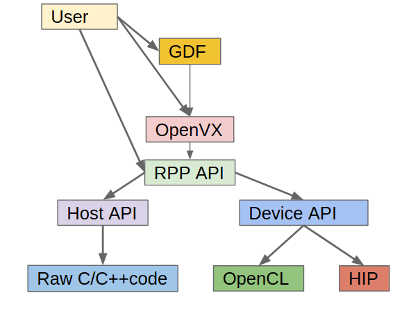

[](https://opensource.org/licenses/MIT)
[](https://travis-ci.org/GPUOpen-ProfessionalCompute-Libraries/rpp)

# Radeon Performance Primitives Library

Radeon Performance Primitives (RPP) library is a comprehensive high-performance computer vision library for AMD (CPU and GPU) with HIP and OpenCL back-ends.

## Top level design
<p align="center"></p>

RPP is developed for __Linux__ operating system.

## Prerequisites
* OS
  * Ubuntu `18.04`/`20.04`
  * CentOS/RHEL `8.0`
* [ROCm supported hardware](https://rocm.github.io/hardware.html)
* [ROCm](https://github.com/RadeonOpenCompute/ROCm#installing-from-amd-rocm-repositories)
* CMake Version `3.5` or higher
* Boost
* Clang: minimum version required: 6.0
* IEEE 754-based half-precision floating-point library - half.hpp

**NOTE:**
* boost
  * Ubuntu
  ```
  sudo apt --yes install libboost-all-dev
  ```
  * CentOS/RHEL
  ```
  sudo yum install boost-devel
  ```

* clang
  * Ubuntu
  ```
  sudo apt --yes install clang
  ```
  * CentOS/RHEL
  ```
  sudo yum install clang
  ```
* half.hpp
```
wget https://sourceforge.net/projects/half/files/half/1.12.0/half-1.12.0.zip
unzip half-1.12.0.zip -d half-files
sudo cp half-files/include/half.hpp /usr/local/include/
```

## Supported Functionalities and Variants

### Supported Functionalities List
<p align="center"></p>

### Supported Functionalities Samples
<p align="center"></p>

### Supported Variants
* Packed 3 Channel (RGB) - PKD3 images
* Planar 3 Channel (RGB) - PLN3 images
* Planar 1 Channel (Greyscale) - PLN1 images
* Affinity - Host and GPU
* Batch Processing - 26 variants
* ROI variants
* Padded variants

## [Instructions to build the library](#rpp-installation)

```
$ git clone https://github.com/GPUOpen-ProfessionalCompute-Libraries/rpp.git
$ cd rpp
$ mkdir build
$ cd build
$ cmake -DBACKEND=OCL .. #for OCL and HOST
        or
$ cmake -DBACKEND=HIP -DCOMPILE=HIPRTC .. #for HIP
$ make -j16
$ sudo make install
```

## Instructions to test functionalities after HOST installation

```
$ cd rpp/utilities/rpp-unittests/HOST_NEW
$ ./testAllScript.sh
```

## Instructions to test functionalities after OCL installation

```
$ cd rpp/utilities/rpp-unittests/OCL_NEW
$ ./testAllScript.sh
```

## Instructions to test functionalities after HIP installation

```
$ cd rpp/utilities/rpp-unittests/HIP_NEW
$ ./testAllScript.sh
```

## MIVisionX(OpenVX) Support
Extended RPP support as a functionality through OpenVX [MIVisionX](https://github.com/GPUOpen-ProfessionalCompute-Libraries/MIVisionX) (Find build instructions and build the amd_rpp library)

## Miscellaneous examples
### RPP stand-alone batch processing code snippet (HOST)

```
// Initializations
int noOfImages = 32;
int channels = 3;
RppiSize maxSize;
maxSize.width = 224;
maxSize.height = 224;

// Allocate host memory and/or obtain input data
unsigned long long ioBufferSize = noOfImages * maxSize.width * maxSize.height * channels;
Rpp8u *input = (Rpp8u *)calloc(ioBufferSize, sizeof(Rpp8u));
Rpp8u *output = (Rpp8u *)calloc(ioBufferSize, sizeof(Rpp8u));
// Get the data for a batch of 224x224 images into 'input' here

// Initialize values for any necessary parameters to the RPP function being called
Rpp32f alpha[noOfImages];
Rpp32f beta[noOfImages];
for (int i = 0; i < noOfImages; i++)
{
    alpha[i] = 1.75;
    beta[i] = 50;
    srcSize[i].width = 224;
    srcSize[i].height = 224;
}

// Create handle
rppHandle_t handle;
rppCreateWithBatchSize(&handle, noOfImages);

// Call the RPP API for the specific variant required (pkd3/pln3/pln1)
rppi_brightness_u8_pkd3_batchPD_host(input, srcSize, maxSize, output, alpha, beta, noOfImages, handle);
```
### RPP stand-alone batch processing code snippet (OCL)

```
// Initializations
int noOfImages = 32;
int channels = 3;
RppiSize maxSize;
maxSize.width = 224;
maxSize.height = 224;

// Allocate host memory and/or obtain input data
unsigned long long ioBufferSize = noOfImages * maxSize.width * maxSize.height * channels;
Rpp8u *input = (Rpp8u *)calloc(ioBufferSize, sizeof(Rpp8u));
Rpp8u *output = (Rpp8u *)calloc(ioBufferSize, sizeof(Rpp8u));
// Get the data for a batch of 224x224 images into 'input' here

// OCL initializations, allocate device memory and copy input data to device
cl_mem d_input, d_output;
cl_platform_id platform_id;
cl_device_id device_id;
cl_context theContext;
cl_command_queue theQueue;
cl_int err;
err = clGetPlatformIDs(1, &platform_id, NULL);
err |= clGetDeviceIDs(platform_id, CL_DEVICE_TYPE_GPU, 1, &device_id, NULL);
theContext = clCreateContext(0, 1, &device_id, NULL, NULL, &err);
theQueue = clCreateCommandQueueWithProperties(theContext, device_id, 0, &err);
d_input = clCreateBuffer(theContext, CL_MEM_READ_ONLY, ioBufferSize * sizeof(Rpp8u), NULL, NULL);
d_output = clCreateBuffer(theContext, CL_MEM_READ_ONLY, ioBufferSize * sizeof(Rpp8u), NULL, NULL);
err |= clEnqueueWriteBuffer(theQueue, d_input, CL_TRUE, 0, ioBufferSize * sizeof(Rpp8u), input, 0, NULL, NULL);
err |= clEnqueueWriteBuffer(theQueue, d_output, CL_TRUE, 0, ioBufferSize * sizeof(Rpp8u), output, 0, NULL, NULL);

// Initialize values for any necessary parameters to the RPP function being called
Rpp32f alpha[noOfImages];
Rpp32f beta[noOfImages];
for (int i = 0; i < noOfImages; i++)
{
    alpha[i] = 1.75;
    beta[i] = 50;
    srcSize[i].width = 224;
    srcSize[i].height = 224;
}

// Create handle
rppHandle_t handle;
rppCreateWithStreamAndBatchSize(&handle, theQueue, noOfImages);

// Call the RPP API for the specific variant required (pkd3/pln3/pln1)
rppi_brightness_u8_pkd3_batchPD_gpu(d_input, srcSize, maxSize, d_output, alpha, beta, noOfImages, handle);

// Copy output data back to host
clEnqueueReadBuffer(theQueue, d_output, CL_TRUE, 0, ioBufferSize * sizeof(Rpp8u), output, 0, NULL, NULL);
```

### RPP stand-alone batch processing code snippet (HIP)

```
// Initializations
int noOfImages = 32;
int channels = 3;
RppiSize maxSize;
maxSize.width = 224;
maxSize.height = 224;

// Allocate host memory and/or obtain input data
unsigned long long ioBufferSize = noOfImages * maxSize.width * maxSize.height * channels;
Rpp8u *input = (Rpp8u *)calloc(ioBufferSize, sizeof(Rpp8u));
Rpp8u *output = (Rpp8u *)calloc(ioBufferSize, sizeof(Rpp8u));
// Get the data for a batch of 224x224 images into 'input' here

// HIP initializations, allocate device memory and copy input data to device
int *d_input, d_output;
hipMalloc(&d_input, ioBufferSize * sizeof(Rpp8u));
hipMalloc(&d_output, oBufferSize * sizeof(Rpp8u));
hipMemcpy(d_input, input, ioBufferSize * sizeof(Rpp8u), hipMemcpyHostToDevice);
hipMemcpy(d_output, output, oBufferSize * sizeof(Rpp8u), hipMemcpyHostToDevice);

// Initialize values for any necessary parameters to the RPP function being called
Rpp32f alpha[noOfImages];
Rpp32f beta[noOfImages];
for (int i = 0; i < noOfImages; i++)
{
    alpha[i] = 1.75;
    beta[i] = 50;
    srcSize[i].width = 224;
    srcSize[i].height = 224;
}

// Create handle
rppHandle_t handle;
hipStream_t stream;
hipStreamCreate(&stream);
rppCreateWithStreamAndBatchSize(&handle, stream, noOfImages);

// Call the RPP API for the specific variant required (pkd3/pln3/pln1)
rppi_brightness_u8_pkd3_batchPD_gpu(d_input, srcSize, maxSize, d_output, alpha, beta, noOfImages, handle);

// Copy output data back to host
hipMemcpy(output, d_output, oBufferSize * sizeof(Rpp8u), hipMemcpyDeviceToHost);
```

### RPP with [GDF](https://github.com/GPUOpen-ProfessionalCompute-Libraries/MIVisionX/blob/master/utilities/runvx/README.md#amd-runvx)(uses OpenVX) code snippet

```
# specify input source for input image and request for displaying input and output images
read input  ../images/face.jpg
view input  inputWindow
view output brightnessWindow

# import RPP library
import vx_rpp
# create input and output images
data input  = image:480,360,RGB2
data output = image:480,360,U008

# compute luma image channel from input RGB image
data yuv  = image-virtual:0,0,IYUV
data luma = image-virtual:0,0,U008
node org.khronos.openvx.color_convert input yuv
node org.khronos.openvx.channel_extract yuv !CHANNEL_Y luma

# compute brightness and contrast in luma image using Brightness function
data alpha = scalar:FLOAT32,1.0  #contrast control
data beta = scalar:INT32,30    #brightness control
node org.rpp.Brightness luma output alpha beta
```
