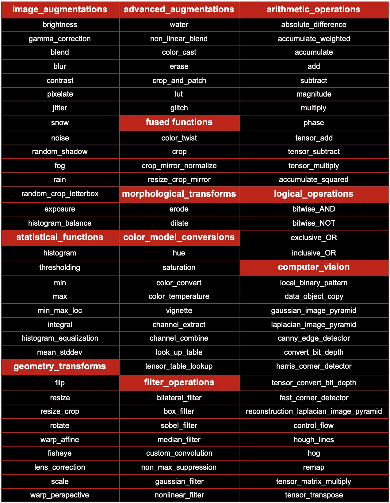

[](https://opensource.org/licenses/MIT)
[](https://travis-ci.com/GPUOpen-ProfessionalCompute-Libraries/rpp)

# ROCm Performance Primitives Library

AMD ROCm Performance Primitives (**RPP**) library is a comprehensive high-performance computer vision library for AMD processors with `HIP`/`OpenCL`/`CPU` back-ends.

#### Latest Release

[](https://github.com/GPUOpen-ProfessionalCompute-Libraries/rpp/releases)

## Top level design

<p align="center"></p>

## Supported Functionalities and Variants

### Supported Functionalities List

<p align="center"></p>

### Supported Functionalities Samples

<p align="center"></p>

### Supported Variants

-   Packed 3 Channel (RGB) - PKD3 images
-   Planar 3 Channel (RGB) - PLN3 images
-   Planar 1 Channel (Greyscale) - PLN1 images
-   Affinity - Host and GPU
-   Batch Processing - 26 variants
-   ROI variants
-   Padded variants

## Prerequisites

* **OS**
  + Ubuntu `20.04`/`22.04`
  + CentOS `7`/`8`
  + RHEL `8`/`9`
  + SLES - `15-SP3`

* [ROCm supported hardware](https://docs.amd.com/bundle/Hardware_and_Software_Reference_Guide/page/Hardware_and_Software_Support.html)

* [ROCm](https://docs.amd.com/bundle/ROCm-Installation-Guide-v5.4.3/page/How_to_Install_ROCm.html) `5.4.3` and above

* Clang Version `5.0.1` and above

  + Ubuntu `20`/`22`
    ```
    sudo apt-get install clang
    ```

  + CentOS `7`
    ```
    sudo yum install llvm-toolset-7-clang llvm-toolset-7-clang-analyzer llvm-toolset-7-clang-tools-extra
    scl enable llvm-toolset-7 bash
    ```

  + CentOS `8` and RHEL `8`/`9`
    ```
    sudo yum install clang
    ```

  + SLES `15-SP3`
    ```
    sudo zypper install llvm-clang
    ```

* CMake Version `3.5` and above

* Boost Version `1.72` and above
  ```
  wget https://boostorg.jfrog.io/artifactory/main/release/1.72.0/source/boost_1_72_0.tar.gz
  tar -xzvf boost_1_72_0.tar.gz
  cd boost_1_72_0
  ./bootstrap.sh
  ./b2 install
  ```
  + **NOTE:** [Install from source](https://www.boost.org/doc/libs/1_72_0/more/getting_started/unix-variants.html#easy-build-and-install)

* IEEE 754-based half-precision floating-point library - half.hpp

  ```
  wget https://sourceforge.net/projects/half/files/half/1.12.0/half-1.12.0.zip
  unzip half-1.12.0.zip -d half-files
  sudo mkdir /usr/local/include/half
  sudo cp half-files/include/half.hpp /usr/local/include/half
  ```

## Prerequisites for Test Suite

* OpenCV `3.4.0`/`4.5.5` - **pre-requisites**
  ```
  sudo apt-get update
  sudo -S apt-get -y --allow-unauthenticated install build-essential libgtk2.0-dev libavcodec-dev libavformat-dev libswscale-dev python-dev python-numpy
  sudo -S apt-get -y --allow-unauthenticated install libtbb2 libtbb-dev libjpeg-dev libpng-dev libtiff-dev libdc1394-22-dev unzip wget
  ```

* OpenCV `3.4.0` /`4.5.5` - **download**
  ```
  wget https://github.com/opencv/opencv/archive/3.4.0.zip
  unzip 3.4.0.zip
  cd opencv-3.4.0/
  ```
  OR
  ```
  wget https://github.com/opencv/opencv/archive/4.5.5.zip
  unzip 4.5.5.zip
  cd opencv-4.5.5/
  ```

* OpenCV `3.4.0`/`4.5.5` - **installation**
  ```
  mkdir build
  cd build
  cmake -D WITH_GTK=ON -D WITH_JPEG=ON -D BUILD_JPEG=ON -D WITH_OPENCL=OFF -D WITH_OPENCLAMDFFT=OFF -D WITH_OPENCLAMDBLAS=OFF -D WITH_VA_INTEL=OFF -D WITH_OPENCL_SVM=OFF -D CMAKE_INSTALL_PREFIX=/usr/local ..
  sudo -S make -j128 <Or other number of threads to use>
  sudo -S make install
  sudo -S ldconfig
  ```

* TurboJpeg installation
  ```
  sudo apt-get install nasm
  sudo apt-get install wget
  git clone -b 2.0.6.1 https://github.com/rrawther/libjpeg-turbo.git
  cd libjpeg-turbo
  mkdir build
  cd build
  cmake -DCMAKE_INSTALL_PREFIX=/usr \
        -DCMAKE_BUILD_TYPE=RELEASE  \
        -DENABLE_STATIC=FALSE       \
        -DCMAKE_INSTALL_DOCDIR=/usr/share/doc/libjpeg-turbo-2.0.3 \
        -DCMAKE_INSTALL_DEFAULT_LIBDIR=lib  \
        ..
  make -j$nproc
  sudo make install
  ```

## Build & Install RPP

The ROCm Performance Primitives (RPP) library has support for three backends: HIP, OpenCL, and CPU:

* Building RPP with the **HIP** backend **(default)**:
```
$ git clone https://github.com/GPUOpen-ProfessionalCompute-Libraries/rpp.git
$ mkdir build && cd build
$ cmake -DBACKEND=HIP ../rpp
$ make -j8
$ sudo make install
```

* Building RPP with the **OPENCL** backend:
```
$ git clone https://github.com/GPUOpen-ProfessionalCompute-Libraries/rpp.git
$ mkdir build && cd build
$ cmake -DBACKEND=OCL ../rpp
$ make -j8
$ sudo make install
```

* Building RPP with the **CPU** backend:
```
$ git clone https://github.com/GPUOpen-ProfessionalCompute-Libraries/rpp.git
$ mkdir build && cd build
$ cmake -DBACKEND=CPU ../rpp
$ make -j8
$ sudo make install
```

## Test Functionalities

### CPU installation

    $ cd rpp/utilities/rpp-unittests/HOST_NEW
    $ ./testAllScript.sh

### OCL installation

    $ cd rpp/utilities/rpp-unittests/OCL_NEW
    $ ./testAllScript.sh

### HIP installation

    $ cd rpp/utilities/rpp-unittests/HIP_NEW
    $ ./testAllScript.sh

## MIVisionX Support - OpenVX Extension

[MIVisionX](https://github.com/GPUOpen-ProfessionalCompute-Libraries/MIVisionX) RPP Extension [vx_rpp](https://github.com/GPUOpen-ProfessionalCompute-Libraries/MIVisionX/tree/master/amd_openvx_extensions/amd_rpp#amd-rpp-extension) supports RPP functionality through OpenVX Framework.

## Miscellaneous examples

### RPP stand-alone batch processing code snippet (HOST)

    // Initializations
    int noOfImages = 32;
    int channels = 3;
    RppiSize maxSize;
    maxSize.width = 224;
    maxSize.height = 224;

    // Allocate host memory and/or obtain input data
    unsigned long long ioBufferSize = noOfImages * maxSize.width * maxSize.height * channels;
    Rpp8u *input = (Rpp8u *)calloc(ioBufferSize, sizeof(Rpp8u));
    Rpp8u *output = (Rpp8u *)calloc(ioBufferSize, sizeof(Rpp8u));
    // Get the data for a batch of 224x224 images into 'input' here

    // Initialize values for any necessary parameters to the RPP function being called
    Rpp32f alpha[noOfImages];
    Rpp32f beta[noOfImages];
    for (int i = 0; i < noOfImages; i++)
    {
        alpha[i] = 1.75;
        beta[i] = 50;
        srcSize[i].width = 224;
        srcSize[i].height = 224;
    }

    // Create handle
    rppHandle_t handle;

    // Set the number of threads to be used by OpenMP pragma for RPP batch processing on host.
    // If numThreads value passed is 0, number of OpenMP threads used by RPP will be set to batch size
    Rpp32u numThreads = 0;
    rppCreateWithBatchSize(&handle, noOfImages, numThreads);

    // Call the RPP API for the specific variant required (pkd3/pln3/pln1)
    rppi_brightness_u8_pkd3_batchPD_host(input, srcSize, maxSize, output, alpha, beta, noOfImages, handle);

### RPP stand-alone batch processing code snippet (OCL)

    // Initializations
    int noOfImages = 32;
    int channels = 3;
    RppiSize maxSize;
    maxSize.width = 224;
    maxSize.height = 224;

    // Allocate host memory and/or obtain input data
    unsigned long long ioBufferSize = noOfImages * maxSize.width * maxSize.height * channels;
    Rpp8u *input = (Rpp8u *)calloc(ioBufferSize, sizeof(Rpp8u));
    Rpp8u *output = (Rpp8u *)calloc(ioBufferSize, sizeof(Rpp8u));
    // Get the data for a batch of 224x224 images into 'input' here

    // OCL initializations, allocate device memory and copy input data to device
    cl_mem d_input, d_output;
    cl_platform_id platform_id;
    cl_device_id device_id;
    cl_context theContext;
    cl_command_queue theQueue;
    cl_int err;
    err = clGetPlatformIDs(1, &platform_id, NULL);
    err |= clGetDeviceIDs(platform_id, CL_DEVICE_TYPE_GPU, 1, &device_id, NULL);
    theContext = clCreateContext(0, 1, &device_id, NULL, NULL, &err);
    theQueue = clCreateCommandQueueWithProperties(theContext, device_id, 0, &err);
    d_input = clCreateBuffer(theContext, CL_MEM_READ_ONLY, ioBufferSize * sizeof(Rpp8u), NULL, NULL);
    d_output = clCreateBuffer(theContext, CL_MEM_READ_ONLY, ioBufferSize * sizeof(Rpp8u), NULL, NULL);
    err |= clEnqueueWriteBuffer(theQueue, d_input, CL_TRUE, 0, ioBufferSize * sizeof(Rpp8u), input, 0, NULL, NULL);
    err |= clEnqueueWriteBuffer(theQueue, d_output, CL_TRUE, 0, ioBufferSize * sizeof(Rpp8u), output, 0, NULL, NULL);

    // Initialize values for any necessary parameters to the RPP function being called
    Rpp32f alpha[noOfImages];
    Rpp32f beta[noOfImages];
    for (int i = 0; i < noOfImages; i++)
    {
        alpha[i] = 1.75;
        beta[i] = 50;
        srcSize[i].width = 224;
        srcSize[i].height = 224;
    }

    // Create handle
    rppHandle_t handle;
    rppCreateWithStreamAndBatchSize(&handle, theQueue, noOfImages);

    // Call the RPP API for the specific variant required (pkd3/pln3/pln1)
    rppi_brightness_u8_pkd3_batchPD_gpu(d_input, srcSize, maxSize, d_output, alpha, beta, noOfImages, handle);

    // Copy output data back to host
    clEnqueueReadBuffer(theQueue, d_output, CL_TRUE, 0, ioBufferSize * sizeof(Rpp8u), output, 0, NULL, NULL);

### RPP stand-alone batch processing code snippet (HIP)

    // Initializations
    int noOfImages = 32;
    int channels = 3;
    RppiSize maxSize;
    maxSize.width = 224;
    maxSize.height = 224;

    // Allocate host memory and/or obtain input data
    unsigned long long ioBufferSize = noOfImages * maxSize.width * maxSize.height * channels;
    Rpp8u *input = (Rpp8u *)calloc(ioBufferSize, sizeof(Rpp8u));
    Rpp8u *output = (Rpp8u *)calloc(ioBufferSize, sizeof(Rpp8u));
    // Get the data for a batch of 224x224 images into 'input' here

    // HIP initializations, allocate device memory and copy input data to device
    int *d_input, d_output;
    hipMalloc(&d_input, ioBufferSize * sizeof(Rpp8u));
    hipMalloc(&d_output, ioBufferSize * sizeof(Rpp8u));
    hipMemcpy(d_input, input, ioBufferSize * sizeof(Rpp8u), hipMemcpyHostToDevice);
    hipMemcpy(d_output, output, ioBufferSize * sizeof(Rpp8u), hipMemcpyHostToDevice);

    // Initialize values for any necessary parameters to the RPP function being called
    Rpp32f alpha[noOfImages];
    Rpp32f beta[noOfImages];
    for (int i = 0; i < noOfImages; i++)
    {
        alpha[i] = 1.75;
        beta[i] = 50;
        srcSize[i].width = 224;
        srcSize[i].height = 224;
    }

    // Create handle
    rppHandle_t handle;
    hipStream_t stream;
    hipStreamCreate(&stream);
    rppCreateWithStreamAndBatchSize(&handle, stream, noOfImages);

    // Call the RPP API for the specific variant required (pkd3/pln3/pln1)
    rppi_brightness_u8_pkd3_batchPD_gpu(d_input, srcSize, maxSize, d_output, alpha, beta, noOfImages, handle);

    // Copy output data back to host
    hipMemcpy(output, d_output, ioBufferSize * sizeof(Rpp8u), hipMemcpyDeviceToHost);

## Technical Support

Please email `mivisionx.support@amd.com` for questions, and feedback on AMD RPP.

Please submit your feature requests, and bug reports on the [GitHub issues](https://github.com/GPUOpen-ProfessionalCompute-Libraries/rpp/issues) page.

## Release Notes

### Latest Release

[](https://github.com/GPUOpen-ProfessionalCompute-Libraries/rpp/releases)

### Changelog

Review all notable [changes](CHANGELOG.md#changelog) with the latest release

### Tested configurations

* Linux distribution
  + Ubuntu - `20.04` / `22.04`
  + CentOS - `7` / `8`
  + RedHat - `8` / `9`
  + SLES - `15-SP3`
* ROCm: rocm-core - `5.5.0.50500-63`
* Protobuf - [V3.12.4](https://github.com/protocolbuffers/protobuf/releases/tag/v3.12.4)
* OpenCV - [4.6.0](https://github.com/opencv/opencv/releases/tag/4.6.0)
