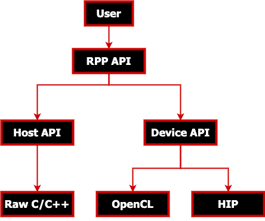

.. meta::
  :description: ROCm Performance Primitives (RPP) documentation and API reference library
  :keywords: RPP, ROCm, Performance Primitives, documentation

.. _what-is:

********************************************************************
What is RPP
********************************************************************

.. image:: https://img.shields.io/badge/license-MIT-blue.svg 
  :target: https://opensource.org/licenses/MIT 
  :alt: MIT licensed

.. image:: https://img.shields.io/badge/doc-readthedocs-blueviolet 
  :target: https://github.com/ROCm/rpp/ 
  :alt: doc

AMD ROCm Performance Primitives (RPP) library is a comprehensive, high-performance computer
vision library for AMD processors that have `HIP`, `OpenCL`, or `CPU` backends.

Supported functionalities and variants
==========================================

.. csv-table::
  :widths: 10, 3, 3, 1, 10, 3, 3, 1, 10, 3, 3

  **image_augmentations**, **CPU**, **GPU**,, **advanced_augmentations**, **CPU**, **GPU**,, **arithmetic_operations**, **CPU**, **GPU**
  brightness, ✅, ✅,, water, ✅, ✅,, absolute_difference, ✅, ✅
  gamma_correction, ✅, ✅,, non_linear_blend, ✅, ✅,, accumulate_weighted, ✅, ✅
  blend, ✅, ✅,,color_cast, ✅, ✅,,accumulate, ✅, ✅
  blur, ✅, ✅,,erase, ✅, ✅,,add, ✅, ✅
  contrast, ✅, ✅,,crop_and_patch, ✅, ✅,,subtract, ✅, ✅
  pixelate, ✅, ✅,,lut, ✅, ✅,,magnitude, ✅, ✅
  jitter, ✅, ✅,,glitch, ✅, ✅,,multiply, ✅, ✅
  snow, ✅, ✅,, **fused functions**, **CPU**, **GPU**,,phase, ✅, ✅
  noise, ✅, ✅,,color_twist, ✅, ✅,,tensor_add, ✅, ✅
  random_shadow, ✅, ✅,,crop, ✅, ✅,,tensor_subtract, ✅, ✅
  fog, ✅, ✅,,crop_mirror_normalize, ✅, ✅,,tensor_multiply, ✅, ✅
  rain, ✅, ✅,,resize_crop_mirror, ✅, ✅,,accumulate_squared, ✅, ✅
  random_crop_letterbox, ✅, ✅,, **morphological_transforms**, **CPU**, **GPU**,, **logical_operations**, **CPU**, **GPU**
  exposure, ✅, ✅,,erode, ✅, ✅,,bitwise_AND, ✅, ✅
  histogram_balance, ✅, ❌,,dilate, ✅, ✅,,bitwise_NOT, ✅, ✅
  **statistical_functions**, **CPU**, **GPU**,, **color_model_conversions**, **CPU**, **GPU**,,exclusive_OR, ✅, ✅
  thresholding, ✅, ✅,,hue, ✅, ✅,,inclusive_OR, ✅, ✅
  min, ✅, ✅,,saturation, ✅, ✅,, **computer_vision**, **CPU**, **GPU**
  max, ✅, ✅,,color_convert, ✅, ✅,,local_binary_pattern, ✅, ✅
  min_max_loc, ✅, ❌,,color_temperature, ✅, ✅,,data_object_copy, ✅, ✅
  integral, ✅, ❌,,vignette, ✅, ✅,,gaussian_image_pyramid, ✅, ✅
  histogram_equalization, ✅, ❌,,channel_extract, ✅, ❌,,laplacian_image_pyramid, ✅, ✅
  mean_stddev, ✅, ❌,,channel_combine, ✅, ❌,,canny_edge_detector, ✅, ✅
  **geometry_transforms**, **CPU**, **GPU**,,look_up_table, ✅, ✅,,harris_corner_detector, ✅, ✅
  flip, ✅, ✅,,tensor_table_lookup, ✅, ❌,,tensor_convert_bit_depth, ✅, ❌
  resize, ✅, ✅,,filter_operations,CPU,GPU,,fast_corner_detector, ✅, ❌
  resize_crop, ✅, ✅,,box_filter, ✅, ✅,,reconstruction_laplacian_image_pyramid, ✅, ❌
  rotate, ✅, ✅,,sobel_filter, ✅, ✅,,control_flow, ✅, ✅
  warp_affine, ✅, ✅,,median_filter, ✅, ✅,,hough_lines, ✅, ❌
  fisheye, ✅, ✅,,custom_convolution, ✅, ❌,,hog, ✅, ❌
  lens_correction, ✅, ✅,,non_max_suppression, ✅, ✅,,remap, ✅, ❌
  scale, ✅, ✅,,gaussian_filter, ✅, ✅,,tensor_matrix_multiply, ✅, ✅
  warp_perspective, ✅, ✅,,nonlinear_filter, ✅, ✅,,tensor_transpose, ✅, ✅

.. 
  csv-table:: Supported Functions - File Version
  :file: ../data/RPP-functions.csv
  :widths: 10, 3, 3, 1, 10, 3, 3, 1, 10, 3, 3

Samples
------------

.. image:: ../data/supported_functionalities_samples.jpg
  :alt: Supported Function Samples

3D Samples
-----------

.. |logo1| image:: ../data/niftiInput.gif     
   :align: middle

+-----------------------------+------------------------------+
|     |logo1|                 |       |logo2|                |
+-----------------------------+------------------------------+
|   | Medical image           | | fused_multiply_add_scalar  |
|                             | | (brightened 3D image)      |
+-----------------------------+------------------------------+

MIVisionX support - OpenVX extension
----------------------------------------

* `MIVisionX <https://github.com/ROCm/MIVisionX>`_ RPP extension
* `vx_rpp <https://github.com/ROCm/MIVisionX/tree/master/amd_openvx_extensions/amd_rpp#amd-rpp-extension>`_ supports RPP functionality through the OpenVX Framework

Latest release
====================

.. image:: https://img.shields.io/github/v/tag/GPUOpen-ProfessionalCompute-Libraries/rpp?style=for-the-badge 
  :target: https://github.com/ROCm/rpp/releases
  :alt: GitHub tag

Release notes
--------------

All notable changes for each release are added to the `Changelog <../CHANGELOG.md>`_.

Tested configurations
----------------------

* Linux distribution
  * Ubuntu - `20.04` / `22.04`
  * CentOS - `7`
  * RedHat - `8` / `9`
  * SLES - `15-SP4`
* ROCm: rocm-core - `5.7.0.50700-63`
* OpenCV `4.6.0 <https://github.com/opencv/opencv/releases/tag/4.6.0>`_

Technical support
======================

For RPP questions and feedback contact `mivisionx.support@amd.com`.

To submit feature requests and bug reports, use the `RPP issues <https://github.com/ROCm/rpp/issues>`_ page.

Documentation
==================

You can build the documentation locally using the following code:

* Sphinx

.. code-block:: shell

    cd docs
    pip3 install -r .sphinx/requirements.txt
    python3 -m sphinx -T -E -b html -d _build/doctrees -D language=en . _build/html

* Doxygen

.. code-block:: shell

      doxygen .Doxyfile

