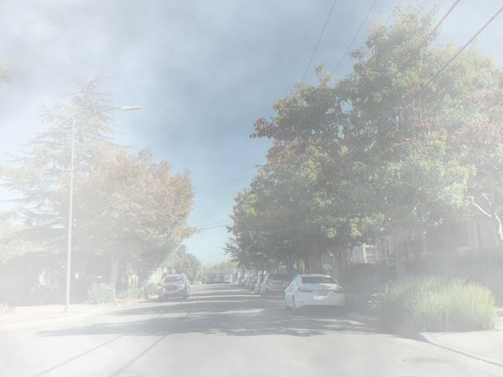
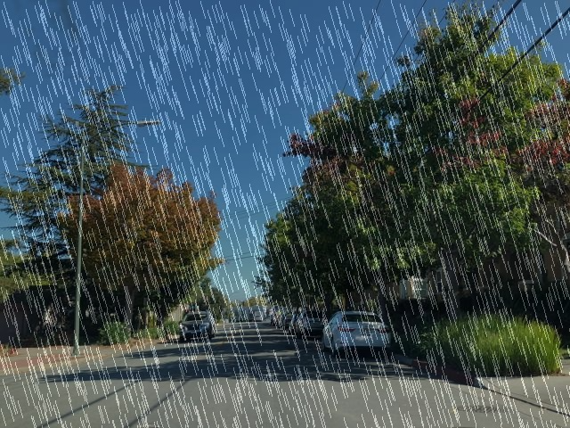
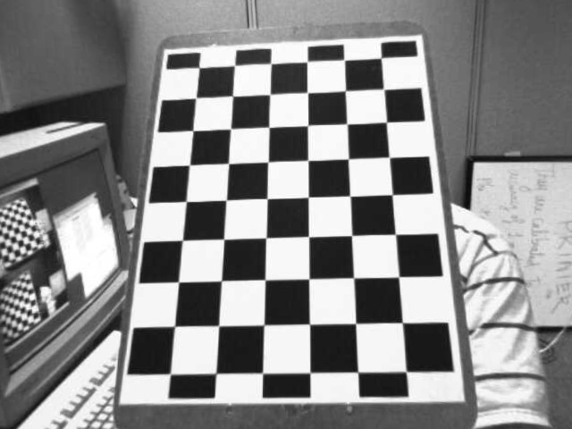
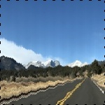
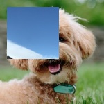
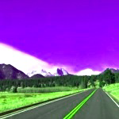

.. meta::
  :description: ROCm Performance Primitives (RPP) supported functionalities
  :keywords: RPP, ROCm, Performance Primitives, documentation, support, functionalities, audio, image

****************************************************************************
ROCm Performance Primitives functionality and variant example outputs
****************************************************************************

The following table shows example outputs of some ROCm Performance Primitives (RPP) functionalities and variants. 

.. csv-table::
  :widths: 1, 2, 1
  :header: "Functionality/variant", "Input", "Output"

  "brightness", |orig_road|, |brightness|
  "gamma correction", |orig_road|, |gamma|
  "blend", |orig_road| |orig_dog|, |blend|
  "contrast", |orig_road|, |contrast|
  "pixelate", |orig_road|,  |pixel|
  "jitter", |orig_road|, |jitter|
  "noise", |orig_road|,  |noise|
  "fog", |orig_street|,  |fog|
  "rain", |orig_street|,  |rain|
  "exposure", |orig_road|,  |exposure|
  "flip", |orig_road|, |flip|
  "resize", |orig_road|, |resize|
  "rotate", |orig_road|, |rotate|
  "warp affine", |orig_road|, |warp_affine|
  "lens correction", |orig_question|, |lens_correct|
  "warp perspective", |orig_road|, |warp_perspective|
  "water", |orig_road|, |water|
  "non-linear blend", |orig_road| |orig_dog|, |nonlinear_blend|
  "color cast", |orig_road|, |color_cast|
  "erase", |orig_road|, |erase|
  "crop and patch", |orig_road| |orig_dog|, |crop_n_patch|
  "lut", |orig_road|, |lut|
  "glitch", |orig_road|, |glitch|
  "color twist", |orig_road|, |color_twist|
  "crop", |orig_road|, |crop|
  "crop mirror normalize", |orig_road|, |crop_mirror_norm|
  "resize crop mirror",  |orig_road|, |resize_crop_mirror|
  "erode", |orig_road|, |erode|
  "dilate", |orig_road|, |dilate|
  "color temperature", |orig_road|, |color_temp|
  "vignette", |orig_road|, |vignette|
  "box filter", |orig_road|, |box_filter|
  "gaussian filter", |orig_road|, |gaussian_filter|
  "magnitude", |orig_road| |orig_dog|, |magnitude|
  "phase", |orig_road| |orig_dog|, |phase|
  "bitwise AND", |orig_road| |orig_dog|, |bitwise_and|
  "bitwise NOT", |orig_road|, |bitwise_not|
  "bitwise exclusive OR", |orig_road| |orig_dog|, |bitwise_xor|
  "bitwise inclusive OR", |orig_road| |orig_dog|, |bitwise_or|
  "remap", |orig_road|, |remap|

.. |orig_road| image:: ../data/doxygenInputs/img150x150.png

.. |orig_question| image:: ../data/doxygenInputs/lens_img640x480.png
    :width: 50%

.. |phase| image:: ../data/doxygenOutputs/geometric_augmentations_phase_img150x150.png

