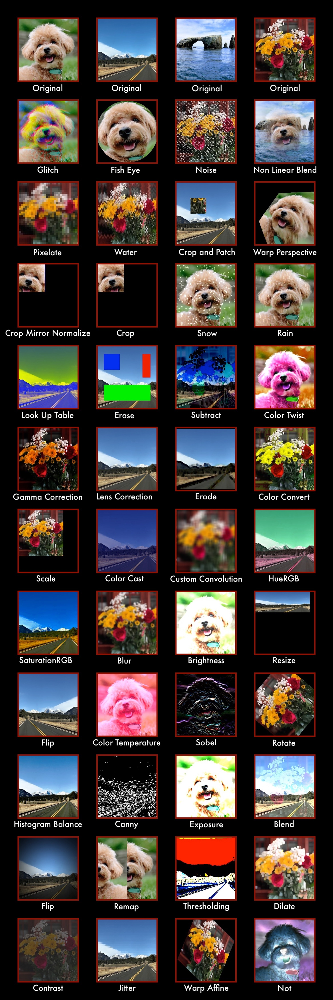

# Supported Functionalities and Variants

## Supported Functionalities List

## Supported Functionalities Samples

## Supported Variants

-   Packed 3 Channel (RGB) - PKD3 images
-   Planar 3 Channel (RGB) - PLN3 images
-   Planar 1 Channel (Greyscale) - PLN1 images
-   Affinity - Host and GPU
-   Batch Processing - 26 variants
-   ROI variants
-   Padded variants
