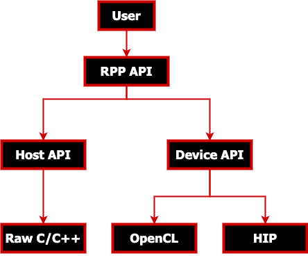
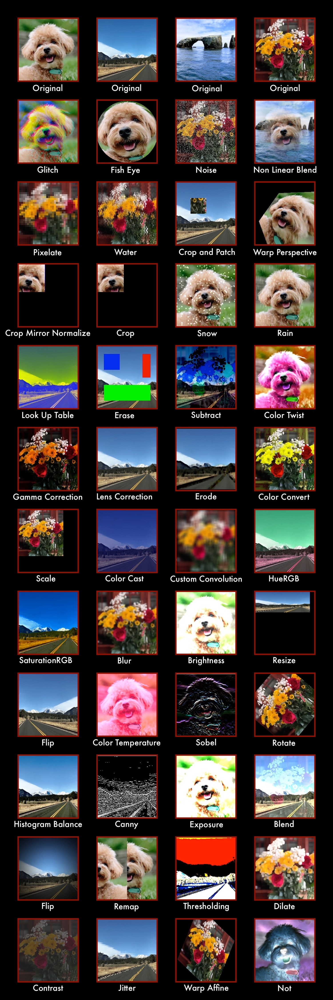

.. meta::
  :description: What is RPP
  :keywords: RPP, ROCm, Performance Primitives, documentation

.. _what-is:

********************************************************************
What is RPP?
********************************************************************

AMD ROCm Performance Primitives (RPP) library is a comprehensive, high-performance computer
vision library for AMD processors that have HIP, OpenCL, or CPU backends.

Supported functionalities and variants
==========================================

The following tables show the CPU and GPU support for various RPP functionalities and variants. You
can view image samples following the tables.

Image augmentations
-----------------------------------------------------------------------------------------------

.. csv-table::
  :widths: 7, 3, 3
  :header: "Type", "CPU", "GPU"

  "brightness", "✅", "✅"
  "gamma correction", "✅", "✅"
  "blend", "✅", "✅"
  "blur", "✅", "✅"
  "contrast", "✅", "✅"
  "pixelate", "✅", "✅"
  "jitter", "✅", "✅"
  "snow", "✅", "✅"
  "noise", "✅", "✅"
  "random shadow", "✅", "✅"
  "fog", "✅", "✅"
  "rain", "✅", "✅"
  "random crop letterbox", "✅", "✅"
  "exposure", "✅", "✅"
  "histogram balance", "✅", "❌"

Statistical functions
-----------------------------------------------------------------------------------------------

.. csv-table::
  :widths: 7, 3, 3
  :header: "Type", "CPU", "GPU"

  "thresholding", "✅", "✅"
  "min", "✅", "✅"
  "max", "✅", "✅"
  "min max loc", "✅", "❌"
  "integral", "✅", "❌"
  "histogram_equalization", "✅", "❌"
  "mean stddev", "✅", "❌"

Geometry transforms
-----------------------------------------------------------------------------------------------

.. csv-table::
  :widths: 7, 3, 3
  :header: "Type", "CPU", "GPU"

  "flip", "✅", "✅"
  "resize", "✅", "✅"
  "resize crop", "✅", "✅"
  "rotate", "✅", "✅"
  "warp affine", "✅", "✅"
  "fisheye", "✅", "✅"
  "lens correction", "✅", "✅"
  "scale", "✅", "✅"
  "warp perspective", "✅", "✅"

Advanced augmentations
-----------------------------------------------------------------------------------------------

.. csv-table::
  :widths: 7, 3, 3
  :header: "Type", "CPU", "GPU"

  "water", "✅", "✅"
  "non-linear blend", "✅", "✅"
  "color cast", "✅", "✅"
  "erase", "✅", "✅"
  "crop and patch", "✅", "✅"
  "lut", "✅", "✅"
  "glitch", "✅", "✅"

Fused functions
-----------------------------------------------------------------------------------------------

.. csv-table::
  :widths: 7, 3, 3
  :header: "Type", "CPU", "GPU"

  "color twist", "✅", "✅"
  "crop", "✅", "✅"
  "crop mirror normalize", "✅", "✅"
  "resize crop mirror", "✅", "✅"

Morphological transforms
-----------------------------------------------------------------------------------------------

.. csv-table::
  :widths: 7, 3, 3
  :header: "Type", "CPU", "GPU"

  "erode", "✅", "✅"
  "dilate", "✅", "✅"

Color model conversions
-----------------------------------------------------------------------------------------------

.. csv-table::
  :widths: 7, 3, 3
  :header: "Type", "CPU", "GPU"

  "hue", "✅", "✅"
  "saturation", "✅", "✅"
  "color convert", "✅", "✅"
  "color temperature", "✅", "✅"
  "vignette", "✅", "✅"
  "channel extract", "✅", "❌"
  "channel combine", "✅", "❌"
  "lookup table", "✅", "✅"
  "tensor table lookup", "✅", "❌"

Filter operations
-----------------------------------------------------------------------------------------------

.. csv-table::
  :widths: 7, 3, 3
  :header: "Type", "CPU", "GPU"

  "box filter", "✅", "✅"
  "sobel filter", "✅", "✅"
  "median filter", "✅", "✅"
  "custom convolution", "✅", "❌"
  "non-max suppression", "✅", "✅"
  "gaussian filter", "✅", "✅"
  "non-linear filter", "✅", "✅"

Arithmetic operations
-----------------------------------------------------------------------------------------------

.. csv-table::
  :widths: 7, 3, 3
  :header: "Type", "CPU", "GPU"

  "absolute difference", "✅", "✅"
  "accumulate weighted", "✅", "✅"
  "accumulate", "✅", "✅"
  "add", "✅", "✅"
  "subtract", "✅", "✅"
  "magnitude", "✅", "✅"
  "multiply", "✅", "✅"
  "phase", "✅", "✅"
  "tensor add", "✅", "✅"
  "tensor subtract", "✅", "✅"
  "tensor multiply", "✅", "✅"
  "accumulate squared", "✅", "✅"

Logical operations
-----------------------------------------------------------------------------------------------

.. csv-table::
  :widths: 7, 3, 3
  :header: "Type", "CPU", "GPU"

  "bitwise ``AND``", "✅", "✅"
  "bitwise ``NOT``", "✅", "✅"
  "exclusive ``OR``", "✅", "✅"
  "inclusive ``OR``", "✅", "✅"

Computer vision
-----------------------------------------------------------------------------------------------

.. csv-table::
  :widths: 7, 3, 3
  :header: "Type", "CPU", "GPU"

  "local binary pattern", "✅", "✅"
  "data object copy", "✅", "✅"
  "gaussian image pyramid", "✅", "✅"
  "laplacian image pyramid", "✅", "✅"
  "canny edge detector", "✅", "✅"
  "harris corner detector", "✅", "✅"
  "tensor convert bit depth", "✅", "❌"
  "fast corner detector", "✅", "❌"
  "reconstruction laplacian image pyramid", "✅", "❌"
  "control flow", "✅", "✅"
  "hough lines", "✅", "❌"
  "hog", "✅", "❌"
  "remap", "✅", "❌"
  "tensor matrix multiply", "✅", "✅"
  "tensor transpose", "✅", "✅"

Image examples
---------------------------------------------------------------

3D images
^^^^^^^^^^^^^^^^^^^^^^^^^^^^^^^^^^^

The following is an example of a 3D medical image before and after ``fused_multiply_add_scalar``.

.. list-table::

  * - Original image
    - Modified image
  * - .. image:: ./data/niftiInput.gif
    - .. image:: ./data/niftiOutputBrightened.gif
